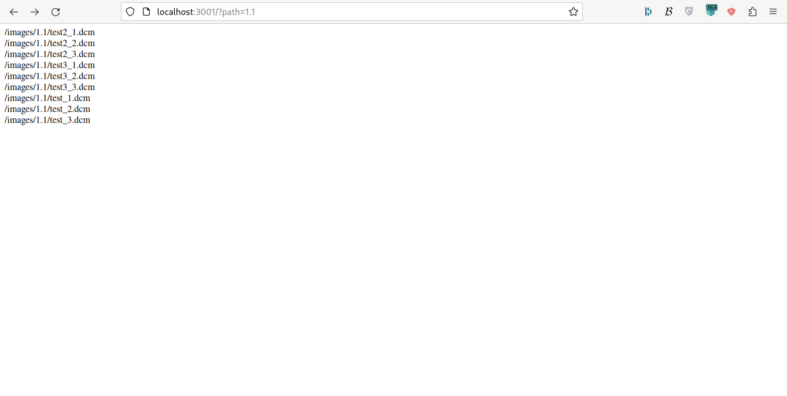

# Breast-Cancer-risk-estimation-system
Breast Cancer risk estimation at a public Mexican hospital

## SFTP server configuration
Consult https://hub.docker.com/r/atmoz/sftp
Make a directory with the name "filesystem" and save images in the format you want.

## Installation
1. mv .env.example .env
2. Change .env into your production variables
3. Install node dependencies 
```bash
yarn
```
4. Start next server
```bash
yarn build && yarn start
```
5. Call the web app as http://localhost:3000/?path=1.1

Final result

